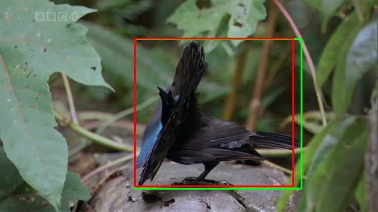
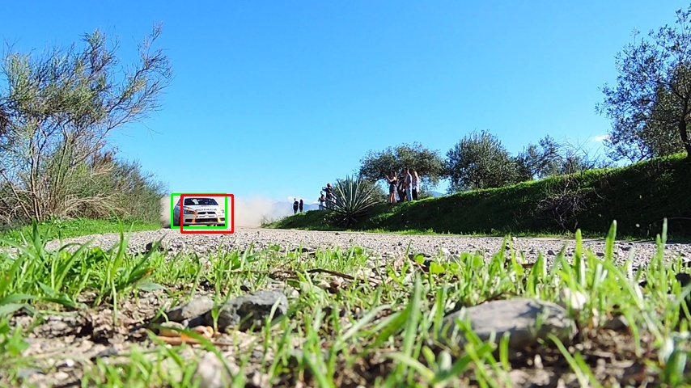
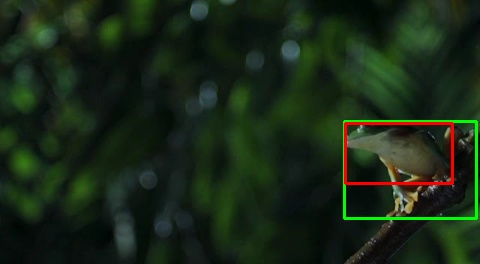
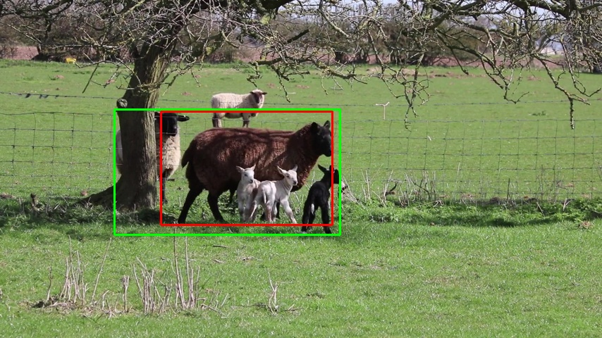
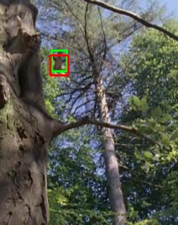

# Moving Object Detection via Optical Flow

**Computer Vision 2025/26 — Mid-Course Project**  
Filippo Facco · Francesco Pizzato

---

## Overview

This project detects and localises a moving object within an image sequence using a two-stage optical flow pipeline:

1. **Dense optical flow** (Farneback) to generate a motion mask
2. **Sparse feature tracking** (Lucas-Kanade) to refine and produce a bounding box

---

## Pipeline

### 1. Preprocessing
Each frame is converted to grayscale before any optical flow computation. Colour information is not needed for motion estimation and its removal reduces computation cost and noise. Gaussian blur was tested but empirically found to degrade detection accuracy, so it was excluded from the final pipeline.

### 2. Dense Optical Flow Mask (Farneback)
Farneback dense optical flow is computed between every pair of consecutive frames. Each frame pair contributes a weighted magnitude map where the weight decays exponentially with frame index (`w = e^-i`), giving more importance to the first frames. The accumulated magnitude is normalised and thresholded using Otsu's method to produce a binary mask. Connected components are analysed: the largest blob is identified and expanded by one pixel via morphological dilation; any blob overlapping this region is retained while isolated blobs are discarded. The resulting mask is passed to the sparse tracking stage.

### 3. Sparse Optical Flow and Bounding Box (Lucas-Kanade)
Shi-Tomasi corner detection extracts up to 300 feature points within the Farneback mask from the first frame. Lucas-Kanade pyramidal optical flow then tracks these points across all frames. The total displacement of each feature is computed as the Euclidean distance between its initial and final position. The bottom 10% of features by displacement are discarded as likely noise or background leakage; the remaining 90% define the final bounding box via `cv::boundingRect`.

---

## Build Instructions

### Requirements
- CMake ≥ 3.10
- OpenCV 4.x

### Steps

```bash
mkdir build && cd build
cmake ..
cmake --build .
```

> **Note:** the `CMakeLists.txt` currently hard-codes the OpenCV path for MSYS2/UCRT64 (`C:/msys64/ucrt64/lib/cmake/opencv4`). Adjust `OpenCV_DIR` in `CMakeLists.txt` to match your local installation if needed.

### Run

```bash
./main <sequence_folder> <output_folder>
```

---

## Project Structure

```
.
├── src/
│   ├── main.cpp
│   ├── PreProc.cpp
│   ├── CreateMaskFarneback.cpp
│   ├── LKOpticalFlow.cpp
│   └── FrameStats.cpp
├── include/
│   ├── PreProc.h
│   ├── CreateMaskFarneback.h
│   ├── LKOpticalFlow.h
│   └── FrameStats.h
├── data/          # Input sequences (bird, car, frog, sheep, squirrel)
├── labels/        # Ground-truth annotations
├── output/        # Detected bounding boxes and result images
└── CMakeLists.txt
```

---

## Results

Detection quality is measured with Intersection over Union (IoU). A prediction is a **True Positive (TP)** when IoU > 0.50.

| Category | Ground Truth | Detected Box | IoU | Outcome |
|---|---|---|---|---|
| Bird | (228, 66) – (511, 321) | (228, 65) – (497, 317) | 0.9321 | TP |
| Car | (212, 240) – (280, 282) | (224, 241) – (288, 288) | 0.6435 | TP |
| Frog | (344, 121) – (477, 219) | (345, 123) – (453, 184) | 0.5055 | TP |
| Sheep | (162, 155) – (483, 334) | (228, 158) – (472, 320) | 0.6880 | TP |
| Squirrel | (75, 73) – (98, 104) | (73, 80) – (100, 110) | 0.5685 | TP |
| **Overall** | 5 categories | 5 / 5 TP | **mIoU: 0.7075** | **Acc: 100%** |

### Output samples

Each sequence produces a result image showing the first frame with the ground-truth bounding box in **green** and the detected bounding box in **red**.

| Bird (IoU 0.9321) | Car (IoU 0.6435) |
|---|---|
|  |  |

| Frog (IoU 0.5055) | Sheep (IoU 0.6880) |
|---|---|
|  |  |

| Squirrel (IoU 0.5685) | |
|---|---|
|  | |

---

## Contributions

| Area | Filippo Facco | Francesco Pizzato |
|---|---|---|
| Ideas & Design | Joint pipeline discussion; proposed grayscale-only preprocessing after empirical comparison with Gaussian blur | Joint pipeline discussion; proposed exponential weighting of frame pairs in the Farneback accumulation |
| Implementation | `PreProc.cpp`, `LKOpticalFlow.cpp`, `FrameStats.cpp` | `CreateMaskFarneback.cpp`, `main.cpp` |
| Testing | Inspected output images and bounding box files | Ran, debugged and verified results on all 5 dataset categories |
| Performance Measurement | Implemented IoU computation, TP/FP classification, mean IoU and accuracy reporting | Verified metric correctness, cross-checked IoU values |
| Working Hours | ~10 hours | ~10 hours |
